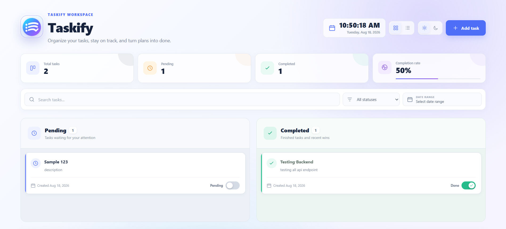
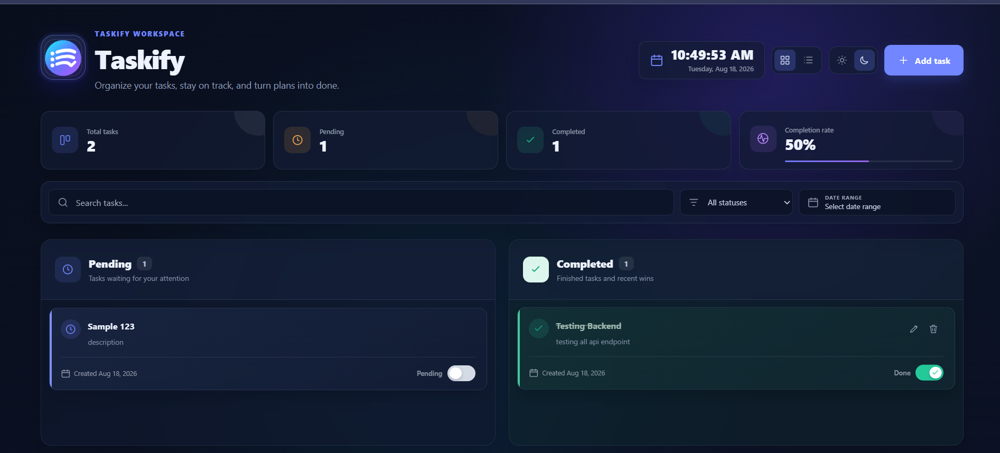
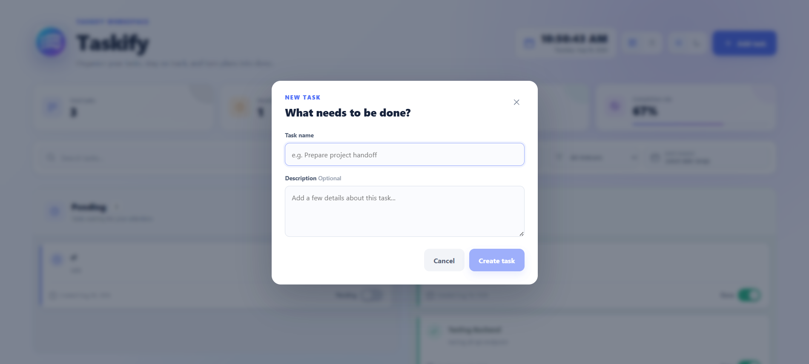
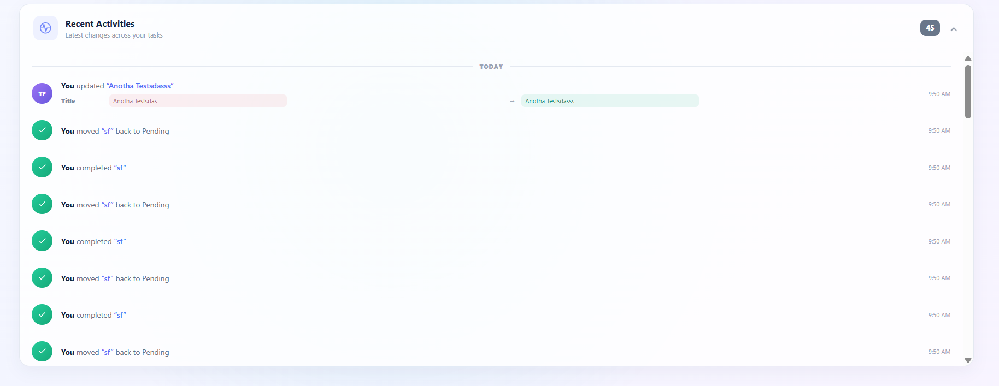

# Taskify

Taskify is a responsive full-stack task management dashboard built with React and Django REST Framework. It combines task CRUD operations with status tracking, productivity metrics, filtering, themes, and detailed activity history.

## Features

- Create, view, edit, and delete tasks
- Animated Pending and Completed status transfers
- Completion congratulation animation
- Total, pending, completed, and completion-rate KPIs
- Live local date and time
- Search, status, and inclusive creation-date filters
- Persistent grid/list layouts and light/dark themes
- Responsive desktop and mobile interface
- Date-grouped Recent Activities timeline
- Audit logs for create, update, status, and delete actions
- Old and new title/description values shown for updates
- Custom Taskify SVG branding and favicon

## Screenshots

### Dashboard Themes

| Light mode | Dark mode |
|---|---|
|  |  |

The dashboard provides live productivity KPIs, task status columns, search and date filters, layout controls, and theme switching.

### Task Creation and Activity History

| Create a task | Recent activities |
|---|---|
|  |  |

Taskify uses a focused creation form and records task changes in a date-grouped audit timeline, including old and new values for updates.

## Technology

| Frontend | Backend |
|---|---|
| React 19, Vite 8 | Python, Django 6 |
| JavaScript and JSX | Django REST Framework |
| Native Fetch API | django-cors-headers |
| Responsive CSS and animations | SQLite |
| Oxlint | |

## Prerequisites

Install these tools before setting up the project:

- **Python 3.12 or newer** — https://www.python.org/downloads/
- **pip** — included with current Python installers
- **Node.js 20.19+ or 22.12+** — https://nodejs.org/
- **npm** — included with Node.js
- **Git** — https://git-scm.com/downloads

On Windows, enable **Add Python to PATH** in the Python installer. Close and reopen the terminal after installing the tools.

Confirm the installations:

```bash
python --version
pip --version
node --version
npm --version
git --version
```

If `python` is not recognized on Windows, use the Python launcher:

```powershell
py --version
py -m pip --version
```

## Project Structure

```text
Miranda_TaskManager/
|-- backend/       # Django API, task app, and migrations
|-- frontend/      # React application and public assets
|-- .gitignore
`-- README.md
```

## Run Locally

### Backend

```bash
cd backend
python -m venv venv
```

Windows users can alternatively create the environment with `py -m venv venv`.

Activate with `venv\Scripts\activate` on Windows or `source venv/bin/activate` on macOS/Linux.

```bash
pip install -r requirements.txt
python manage.py migrate
python manage.py runserver
```

The API runs at `http://127.0.0.1:8000/`.

### Frontend

In a second terminal:

```bash
cd frontend
npm install
npm run dev
```

Open `http://localhost:5173/`. Both servers must be running.

## Data

A task contains `id`, `title`, `description`, `completed`, and `created_at` fields.

Each TaskLog stores the affected task, action, timestamp, and old/new data snapshots. Supported actions are `CREATE`, `UPDATE`, `STATUS_UPDATE`, and `DELETE`. Update records retain old and new title and description values.

## API

### Tasks

| Method | Endpoint | Description |
|---|---|---|
| `GET` | `/tasks/` | List tasks, newest first |
| `POST` | `/tasks/` | Create a task |
| `GET` | `/tasks/{id}/` | Retrieve a task |
| `PUT` | `/tasks/{id}/` | Update title and description |
| `PATCH` | `/tasks/{id}/` | Toggle completed status |
| `DELETE` | `/tasks/{id}/` | Delete a task |

### Activity Logs

| Method | Endpoint | Description |
|---|---|---|
| `GET` | `/logs/` | List logs, newest first |
| `GET` | `/logs/{id}/` | Retrieve a log |

The logs API is read-only.

Toggle a task status with `PATCH /tasks/{id}/` and an empty JSON body.

## Filtering and Preferences

Search, status, and date filters work together. Creation timestamps are converted to the user's local calendar date before filtering, keeping displayed dates and results consistent across timezones. Theme and layout preferences are stored in browser local storage.

## Validation

```bash
cd frontend
npm run lint
npm run build
```

```bash
cd backend
python manage.py check
python manage.py test
```

## Development Notes

- The React client currently uses `http://127.0.0.1:8000/`.
- SQLite is for local development and is excluded from Git.
- Authentication and multi-user ownership are outside the current scope.
- Move `SECRET_KEY`, `DEBUG`, allowed hosts, and other environment-specific settings to environment variables before production deployment.
